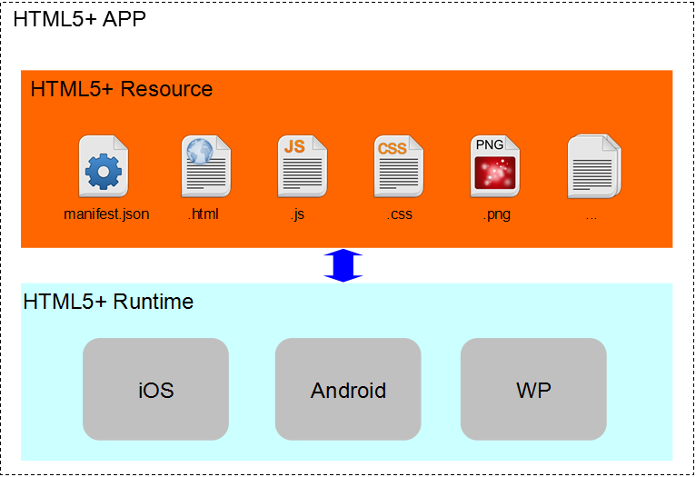
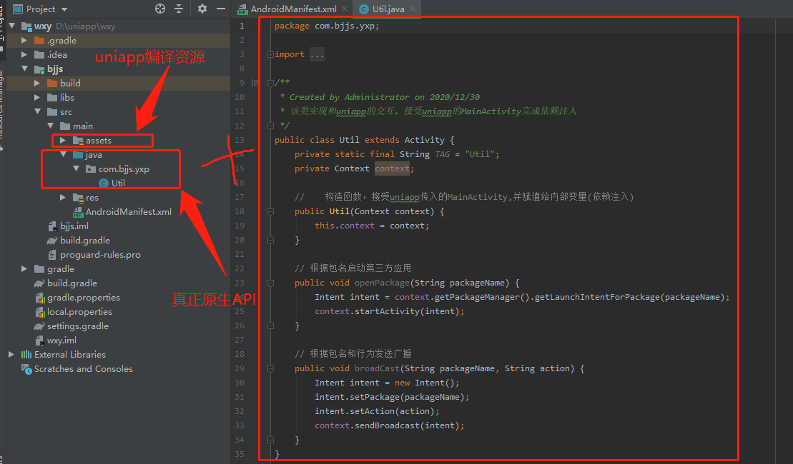

[toc]

## 一、前言

关于uniapp的学习作业本来是想跟着课程走的，实在是这近项目太紧，没怎么上课，只是浏览了视频课程的主要内容，还好没出我目前掌握的范围，本想先写一篇uniapp学习常规篇vue和nvue开发呢，但是没有什么好的思路，只有大纲，而uniapp的原生访问和混合开发是目前项目的难点，我想也是大部分学习uniapp的难点，我在Gitee<https://gitee.com/freegroup81/uniapp>和Github<https://github.com/woxiaoyao81/uniapp>中离线打包目录中分享离线打包详细过程，尤其是遇到问题的解决方案，也是本文学习的前提，由于详细步骤图片太多，就不上传PHP中文网了，教程里面部分地方本文会进行修正。

云打包和离线打包选择:在DCloud官方<https://ask.dcloud.net.cn/article/37979>介绍新推出的安心打包功能有介绍二者区别，云打包 **可原生混淆，保护js代码和使用插件市场的付费原生插件** ，而离线打包没有，相反它要求有AS编译经验，有开发经验更好，当然它带来的混合开发可以任意扩展功能就不是云打包可比了，我在离线打包中已经演示了启动第三方应用，向第三方应用发送广播和打开系统网络设置界面。再者云打包是占用资源的，DCloud为用户每天提供了10次打包机会，包大小不超过40M。

说实在话，当时写离线打包是被逼的，因为不会NJS，只到写这篇文章才算是真正入门了，可以将任意Java代码转换为NJS实现，这样就可以云打包了，可以利用云打包的优势保护代码和使用云端插件。本文完全从实战出发，理论可能比较少，还望理解。

推荐官方学习网址:DCloud_App_Array写的入门教程<https://ask.dcloud.net.cn/article/88>和示例汇总<https://ask.dcloud.net.cn/article/114>，最最值得推荐就是官方HbuilderX自带的Hello 5+的HTML5Plus规范演示，它基本演示绝大部分应用。也是我学习的主要来源。

## 二、HTML5Plus和NativeJS的原生访问能力

HTML5中国产业联盟之前是W3C中国指导下，由DCloud和CSDN作为发起单位、由十几家HTML5从业单位组成的组织，为HTML5开发者提供全方位的开发、发行、培训、外包、宣传、融资服务，其制定的HTML5+标准规范，是对HTML5的一种扩展，扩展后的HTML5可以达到原生的功能和体验。目前已经有几十万开发者在使用HTML5+技术，数亿手机设备安装有HTML5+引擎，包括京东、大众点评、网易有道、唯品会、携程等众多一线开发商。

### 1、H5+与Native.js区别

初次接触uniapp的原生访问能力时，往往分不清H5+和nativejs的区别，这里可以看官方5+ App开发入门指南<https://ask.dcloud.net.cn/article/89>，不得不说，DCloud文档真是没整理好，让学习充满了挑战。

HTML5+规范是一个开放规范，隶属于工信部，允许三方浏览器厂商或其他手机runtime制造商实现。是一种基于HTML、JS、CSS编写的运行于手机端，可以通过扩展的JS API任意调用手机的原生能力，实现与原生App同样强大的功能和性能。



HTML5+扩展了JavaScript对象plus，使得js可以调用各种浏览器无法实现或实现不佳的系统能力，设备能力如摄像头、陀螺仪、文件系统等，业务能力如上传下载、二维码、地图、支付、语音输入、消息推送等。除了功能外，HTML5+很重要的特点是提供了原生的渲染能力，通过plus.webview、plus.nativeObj、plus.nativeUI，让开发者可以使用js来调用原生渲染能力，实现体验的大幅提升。原生的api多达40万，HTML5+的封装并非把40万api都封装了一遍，而是分成了2个层面：

- HTML5Plus规范：常用的扩展能力，比如二维码、语音输入，都封装到了规范中，同时实现了Android和iOS的解析引擎，使得开发者的代码编写一次，**可跨平台运行** 。

- Native.js是另一项创新技术。手机OS的原生API有四十多万，大量的API无法被HTML5使用。Native.js把几十万原生API映射成了js对象，通过js可以直接调ios和android的原生API。这部分就 **不再跨平台**，写法分别是plus.ios和plus.android，比如在android手机桌面创建快捷方式，这些都是平台专有的api。

理解就是Native.js是H5+一个组成部分，其中一个部分是跨平台API，平台差异由Dcloud解决了，另一个是原生api太多，不可能全部提供封装，就分平台提供直接调用API进行原生访问能力。

### 2、MUI和H5+区别

二者都实现了跨Android和IOS平台原生访问，都不支持小程序，调用方式也非常相似，其实个人感觉是一回事，区别就是MUI一个是独立的js库，而H5+是封装到HBuilderX编辑器的编译引擎了。

### 3、Java转NJS的总结【重点】

建议首先要认真学习DCloud_App_Array老大写的入门教程，熟悉理解一般Java代码转NJS代码的思路，我就不写入门教程，这个老大写的入门教程已经非常详细了，不过老大写的只是入门教程，所以比较复杂的Java代码转换就没提到，此时再看我这个提高篇就基本完全掌握Java转NJS代码的要点了，基本可实现任何Java代码转NJS代码了。为了直观，先上Java代码,功能是获取本机所有软件的包名和应用名

```java
//Java实现代码
//获取PackageManager
PackageManager packageManager = context.getPackageManager();
//获取所有已安装程序的包信息
List <PackageInfo> packageInfos = packageManager.getInstalledPackages(0);
// 遍历所有安装程序的包信息和应用程序名
ApplicationInfo applicationInfo = null;
if (packageInfos != null) {
 	for (int i = 0; i < packageInfos.size(); i++) {
 		String packName = packageInfos.get(i).packageName;
		applicationInfo = packageManager.getApplicationInfo(packName, 0);
 		String appName=(String)((applicationInfo != null) ? packageManager.getApplicationLabel(applicationInfo) : "???");
 		Log.e(TAG, "PackageName:" + packName+",ApplicationName:"+appName);
	}
 }
```

入门教程中提到两类调用方式，一个是常规的plus.android.importClass，另一个是高级plus.android.newObject，在这里由于是类的连续调用，不再是简单的一次调用，而且返回也都是Android的类对象，直接使用上面两个是无法完成的，经测试根本实现不了，这就是要提到二者使用时机了，后面在提的要点有详细说明。通过打印信息，提示信息中经常见到null或JSBObject对象信息，JSBObject应该是NJS转换的Java对象，通过JSON也不能获取，最后还是那篇文章作者在回复中提到的invoke解开了我的思路，不过可惜该作者并没提到具体实现细节，经过一天学习和测试终于解开答案，也敲开了NJS的大门。为了帮助后来者，我专门在论坛发表文章，希望后来者小走点弯路，同时希望解决的人能及时分享。

> **最宝贵经验的总结**
>- 1、plus.android.runtimeMainActivity()，起初我认识它就是普通Activity，其实它是Context，它是Html5+运行期环境主组件，用于处理与用户交互的各种事件，也是应用程序全局环境android.app.Activity的实现对象，是唯一的，生命周期是应用程序生命周期，可以完成所有有关程序的操作,至于Context重要可以百度.
>- 2、plus.android.getAttribute和plus.android.setAttribute，获取或设置类或对象的属性，不再建议使用.来操作了，对于属性就建议使用它两个都可以完成了，毕竟android中java类还是比较复杂的，一个不好就访问了非静态常量，它两者则不存在这样问吧
>- 3、plus.android.invoke调用类或对象的方法，支持静态或非静态，同样不建议使用.来操作了，原因同上。无论是importClass获取类对象(ClassObject)还是newObject获取的实例对象(InstanceObject)使用这种方法调用方法则没问题
>- 4、遇到上面这种不断调用类的方法获取下一步操作的对象，甚至是能完.连续调用的，一定要使用我上面介绍的一个对象和三个函数来转换，其它都会非常容易出现失败的。同时要牢记为了思路清晰， **连续调用可分解为一个一个invoke调用，返回的对象就用let申明即可** ，这里有个 **最大误区就是以为要和Java一样，先导入类再定义返回的对象，我开始也是在这里迷茫的，JS中不存在让它种写法啊，就是使用构造函数传递返回值相当于this来获取，结果经常返回null或JSBObject** 后来想明白了，在JS中只有对象概念，才不管你是A类的对象还是B类的对象，只要是对象就是由属性和方法组成，上面转换代码你引入类就是多此一举了。
>- 5、plus.android.importClass和plus.android.newObject什么时候使用呢？Java代码中调用类的静态方法或new获得的对象的代码就需要使用它们了，前者使用importClass，后者使用newObject。

如果你理解我的代码，也掌握我提的五个要点，尤其是前面四个要点，任何Java代码转NJS都不再算复杂了，下面是我转换的NJS代码，可结合我上面的经验来理解

```javascript
//NJS代码
const main = plus.android.runtimeMainActivity();
let pManager = plus.android.invoke(main, 'getPackageManager');
let pInfo = plus.android.invoke(pManager, 'getInstalledPackages', 0);
let total = plus.android.invoke(pInfo, 'size');
let packName = '';
let appName = '';
let obj = null;
// 遍历获取包名和应用名称
for (let i = 0; i < total; i++) {
	// 获取包名
	packName = plus.android.getAttribute(plus.android.invoke(pInfo, 'get', i), 'packageName');
	// 获取包名对应的应用名
	obj = plus.android.invoke(pManager, 'getApplicationInfo', packName, 0);
	appName = plus.android.invoke(pManager, 'getApplicationLabel', obj);
	console.log(packName, appName);
}
```

在转换NJS代码中过程中返回对象是不要纠结什么类的对象，因为JS只有对象的概念，可以用let即可，invoke调用建议是一个方法一个，网上有嵌套调用的，不容易理解，这样经过我测试没任何问题，而且清晰明了。要用getAttribute或setAttribute操作属性。最后一定要注意`plus.android.runtimeMainActivity`,它是android.content.Context，是Html5+运行期上下文环境，是全局的，只有一个，软件关闭才释放，也是混合开发的主要依据。

详细代码已经发布到DCloud插件市场<https://ext.dcloud.net.cn/plugin?id=3869>，可以下载学习。

### 4、其实相关的学习

`plus.android.currentWebview`获取当前Webview窗口对象的native层实例对象,我理解是即当前Activity，Android平台完整Java类名为android.webkit.Webview。而且记得还有种特殊的调用，不记得了，自己学习自带Hello 5+范例中应该有

`plus.android.implements`在Java中可以通过定义新类并实现Interface的接口，并创建出新类对象作为其它接口的参数，在NJS中则可快速创建对应的Interface对象,我使用比较少，目前转换NJS代码没用到，以后用到再说明。

`plus.NativeUI`纠正入门教程中错误，老大写居了`plus.ui.alert`,其实是`plus.NativeUI.alert`。

`遇到JSBObject对象`这个就是Java对象调用方法时，转换时你使用newObject或importClass的结果，使用invoke就不会出现这样问题了。

## 三、uniapp与AS的混合开发

### 1、NJS和混合开发选择

所谓混合开发就是代码实现不通过uniapp的NJS实现了，它只是调用一下而已，代码真正实现是原生API实现的，就如下图中演示的位置



有了NJS提供原生访问能力，为什么还要混合开发？一个是效率问题，NJS在Java对象转JS对象时存在消耗，若是实时性强则无法满足，在我上面获取本机所有包名和应用名时往往需要等待3秒左右，我不得不加上加载状态了，否则会认为死机或不成功呢，而混合开发减少转换次数，就减少了消耗。另一个就是可以任意扩展功能，而且也可以开发uniapp原生插件供自己或他人使用原生能力。

### 2、混合开发的实现

至于AS安装和配置一定要明白，实在不明白可看我的教程，算是比较详细了，对于遇到问题也解析比较到位。我这里简单说下原生开发了，可以参考其它高级语言的理解，如果你有过C++、PHP的开发经验的，入门并不难。它的命名空间关键字是package，引用是import。这里有个很重要建议就是，为类设置静态常量，其值为H5+运行期的上下文，还记得上面我提到的`plus.android.runtimeMainActivity`，在uniapp实例化对象时将它传进来，这样就可以绑定当前uniapp应用了，通过它可以完成启动第三方应用、向其它应用发送广播、打开系统设置等。

```java
//Java
package com.bjjs.yxp;

import android.app.Activity;
import android.content.Context;
import android.content.Intent;
import android.content.pm.PackageInfo;
import android.content.pm.PackageManager;

/**
 * Created by Administrator on 2020/12/30
 * 该类实现和uniapp的交互，接受uniapp的MainActivity完成依赖注入
 */
public class Util extends Activity {
    private static final String TAG = "Util";
    private Context context;

    //    构造函数，接受uniapp传入的MainActivity,并赋值给内部变量(依赖注入)
    public Util(Context context) {
        this.context = context;
    }

    // 根据包名启动第三方应用
    public void openPackage(String packageName) {
        Intent intent = context.getPackageManager().getLaunchIntentForPackage(packageName);
        context.startActivity(intent);
    }

    // 根据包名和行为发送广播
    public void broadCast(String packageName, String action) {
        Intent intent = new Intent();
        intent.setPackage(packageName);
        intent.setAction(action);
        context.sendBroadcast(intent);
    }
}
```

在uniapp中调用还是使用NJS，不过只是实例化这个对象，调用方法就可以了

```javascript
// #ifdef APP-PLUS
// 根据包名打开第三方应用
const main=plus.android.runtimeMainActivity();
let util=plus.android.newObject('com.bjjs.yxp.Util',main);
util.openPackage("com.ndwill.swd.appstore");
// #endif

```

### 3、其它需要注意的

目前Hbuilder已经发布了3.0.5，在我前面写的教程中还是2.9.8，当前官方HBuilder-Integrate-AS使用Android Gradle Plugin还是3.3.2,而Gradle是4.1.0版，而现在官方已经说明Android Gradle要换成4.1.1,对应已经是Gradle是6.5.0版了，其它可参考这个官方示例来配置，不过maven一定要换成阿里云的，具体可见教程。