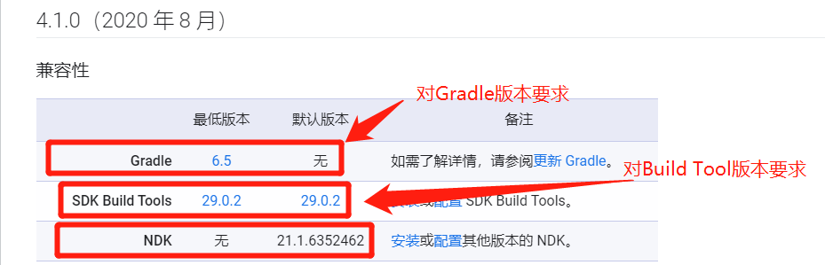

## 前言

HBuilderX虽然比不上VSCode，毕竟后者的依托微软巨头，但其推出的uniapp在支持国产特色上如小程序还是优于VSCode和Flutter(尽管介绍都是说Flutter如何优秀，便不支持小程序在中国就是硬伤)。它为使用者提供了云打包和离线打包两种形式，但云打包有着次数限制(好像每天10次,可付费解锁)，并且服务器繁忙时需要排队等候，不利于开发者的正常调试。从另一方面来看，尽管官方对于隐私保护极为重视，但还是无法让使用者打消代码上传泄露的疑虑，所以离线打包作为第二条打包途径理当重视。后面还有一点就是云打包无法实现uniapp和android混合编码，只能通过H5+的来调用android原生代码，有时这样方式非常低效。具体可见最后的介绍。


这里要记录，是因为如果你一味按官方的离线打包教程是无法成功，它有好多问题没指出，当然本文也只是总结我遇到的问题，若有其它问题欢迎一起探讨。学习uniapp离线打包，其实就是Android Studio打包，所以从它开始讲起。

## 一、Android Studio入门

2013年5月16日，在I/O大会上，谷歌推出新的Android开发环境——Android Studio(后面简称AS)，现在已经发布到了4.1.1版了，它的官方是<https://developer.android.google.cn>，它有工具下载、教程和开发文档，是AS开发的官方权威。关于AS中引入的包或类的参考文档对于初学者可能找不到地方，现在贴出它的地址<https://developer.android.google.cn/reference/packages>。

### 1、JDK

AS开发环境配置是入门者第一个难关，我也停留这好多次，只到现在才基本算是成功了。对于AS4.1来说，它安装前提是JDK，建议是JDK8以后版本，我使用的JDK11(LTS)长期版。

> JDK自11以后默认是没有jre了，想要需要使用命令`bin\jlink.exe --module-path jmods --add-modules java.desktop --output jre`手动生成JRE,如果不成功，请以管理员身份运行命令，而JDK8自带jdk和jre。

进入JDK官方下载地址 <https://www.oracle.com/java/technologies/javase-downloads.html>选择好JDK版本，点击【JDK Download】按钮


根据开发的平台选择版本。我的系统是win10-64位，选择如下的版本：


如果需要登录账号密码，可以直接网上找一个Oracle共享账号密码就行，或者自己注册一个即可。下面是网上找的账号密码，亲测可用。Oracle帐号：2696671285@qq.comOracle，密码：Oracle123。

下载后，可以鼠标右击【jdk-11.0.9_windows-x64_bin】选择【以管理员身份运行】，然后就一直下一步就好了，但是要注意要保存安装的目录，后面会用到。打开jdk的安装路径，选中地址栏鼠标右击选择【复制】。温馨提示：jdk的默认安装路径是【C:\Program Files\Java\jdk-11.0.9】。


右击【此电脑】、选择【属性】、选择【高级系统设置】、在系统变量下点击【新建】


变量名输入【JAVA_HOME】，在变量值栏中使用快捷键Ctrl+V粘贴jdk的路径，然后点击【确定】。


一样点击【新建】。变量名中输入【CLASSPATH】,变量值中输入【.;%JAVA_HOME%\lib】（建议直接复制【】里面的内容）然后点击【确定】。


找到系统变量中的【Path】变量，然后点击【编辑】。点击【新建】，输入【%JAVA_HOME%\bin】然后点击【确定】。


把所有窗口点击确认退出即可。按下键盘上的快捷键【win+r】，输入【cmd】然后点击【确定】，输入【java -version】并按下键盘上的【Enter】键得到jdk的安装版本。


输入【java】然后按键盘上面的【Enter】键，得到以下信息。


输入【javac】然后按键盘上面的【Enter】键，得到以下信息。


到这里JDK就安装以及配置完毕啦。如果你想使用jre则使用前面的命令先生成jre，然后加入到系统环境变量中【%JAVA_HOME%\jre\bin】。由于AS4.1已经自带jre，所以对于AS可以不配置。如果你想换AS的jre则需要生成jre，自己看情况选择吧。我使用AS自带的jre也没出错。

### 2、AS

JDK已经安装好了，现在该AS登场了，它的下载地址是官方<https://developer.android.google.cn/studio>


根据系统选择版本，我的系统是win10-64位，选择如下的版本：


下载后，以管理员身份打开android-studio-ide-201.6858069-windows.exe安装包，等待加载出以下画面，直接点击【Next】，基本是默认设置就可以，最后点击【finish】按钮并启动程序。


这一步是询问你是否需要导入以往Android Studio的配置，如果以前装过Studio则可以导入以往的配置，否则选择【Do not import setting】即可，然后点击【ok】


等待启动，启动后会出现，询问是否需要设置代理，在这里先选择不需要【Dont’t send】


下一步，是询问是否设置代理，网上教程一般都是忽略，这里我们要设置，不然在编译时会慢。
目前经常用的是mirrors.neusoft.edu.cn:80。


点击【Next】


选择第一个默认的标准配置就好


选择主题，我喜欢黑色，选择了Darcula，选择好了点击【Next】


这个时候，它会列出即将要下载的清单，我们可以看到清单里面有Android SDK，这一步我们可以截一下图记录下SDK、JDK的安装目录，然后点击【Finish】。


根据清单下载资源，因为这一步需要访问外网，有可能会出现下载失败的情况，但是没关系跟着我一步一步安装就没问题（这一步需要等一会），例如，我在安装时就出现了以下的错误，我们先截个图把问题记录下来。可以点击重试【Retry】按钮，不过一般点击重试都是没用的，我们直接点击【Cancel】，等到后面再处理。当然不出现这种问题的话那就更好。


### 3、SDK和Build Tool

Android SDK已经不需要单独下载了，在安装AS后可以通过AS的SDK Manager下载。


默认安装情况下都会已经下载好最新的SDK和SDK Build Tool编译工具。可通过勾选“Show Package Details ”看到版本信息和更多细节，这是设置环境的重要依据。其中status栏中installed表示已经安装，Not installed是未安装，安装只要勾选，然后点击"Apply"按钮就会下载，默认是访问Google的，比较慢，如果添加代理将比较快【强烈建议使用代理，具体见前面】。


### 4、第一个android程序

创建新的project，选择创建的主题，我这里选择一个空的手机主题，然后点击【Next】下一步


修改Name：项目的名称、Package name：包名、Save location：项目保存的位置、Language：开发语言(官方推荐Kotlin，而我们常选Java，Google好尴尬)、Minimum SDk：开发安卓的版本，选择版本越低兼容性就越高，因为安卓系统是向下兼容的，为了兼容更多手机，尽量不要选择太高的安卓版本，并有版本占有率介绍。然后点击【Finish】


工程正在初始化，这里也要保持网络的连接，因为这里也是需要下载一些网络资源的，也是从Google上下载，所以会有点慢，我们可以点击右下角那里查看任务。**再一次强烈建议使用代理,否则你会被编译速度搞到崩溃，我的项目现在都是快速编译完成**


现在简单介绍下APP项目及其运行原理。Android是代码和视图分离的，视图在res\layout中定义的xml文件，一个对应一个窗口，默认创建的activity_amin.xml是主窗口。而java下包名目录下有java文件，它是代码部分，其中MainActivity.java就是主入口，就如C++中WinMain或main。manifests下 的AndroidManifest.xml是软件的核心配置文件，它定义了窗口和代码中重要信息，具体可查阅网文，如果查找某个app的主入口，可通过下图指示的寻找。运行时，引擎从AndroidManifest读取入口，本例中就是MainActivity，它继承Android内置的类，在启动完成后加载窗口。


### 5、建议设置和快捷键

个人感觉这个是非常重要的，有的设置可以减少报错的概念。

#### (1) 编码都设置为UTF-8

Android Studio 1.1默认的编码方式是utf-8，到了Android Studio 1.2默认的编码方式竟然是GBK，到了Android Studio 2.1，默认的部分编码方式是utf-8，我们还是统一设置为UTF-8吧，不要坑队友哦：


#### (2) 设置代理，提高编译和下载速度

勾选"Automatic proxy configuration URL"，目前代理常用的是大连东软信息学院镜像mirrors.neusoft.edu.cn 端口:80和南阳理工学院镜像mirror.nyist.edu.cn 端口:80。


#### (3) 其它优化配置

设置自动导包,我们只有每次引用一些类的时候必须要导包，而AS可以设置成自动导包。设置如下：


禁止代码折叠：Intellij IDEA默认有很多地方的代码都会自动折叠，设置如下：


修改新建文件文件头：


#### (4) 常用快捷键

|快捷键|作用|
|-------|-----|
|Ctrl+Alt+S|         打开配置界面 |
|Ctrl+Q  |             代码再次提示 |
|Ctrl+Alt+L |       代码格式化   | 
|Ctrl+空格|         代码补全，需要编译器提示的时候使用|
|Ctrl+Alt+O|       删掉多余引用的包|
|Alt+Enter |        导入需要的包，一般引用一些类，且该类所在包没有自动导入时，会提示|
|Ctrl+Z|              撤销上一步操作|
|Ctrl+Shift+Z|    取消撤销操作|
|Ctrl+X|             删除当前行。只要光标在该行就行，不必选中整行|
|Ctrl+B|            如果当前光标在变量或方法名上，则找出定义该变量或方法的地方，并跳转。可以通过这个方式查看android类库源码。 如果当前光标在变量或方法的定义上，则找出该项目中出现变量名或方法名的地方，显示出来，点击相应位置就能进行跳转|
| Ctrl+Shift+BackSpace|返回上一次编辑的地方。可以与上一个快捷键配套，在Ctrl+B查看方法定义后，用此快捷键回到刚才编辑的地方|
|Shift+Enter|光标跳转到行末尾并回车。这样就不用每次用鼠标点击行末或者用键盘移动到行末再回车了，一键做完这两个操作|

## 二、uniapp本地离线打包

前言中已经介绍了本地离线打包的好处,归纳下就是可调试、防代码泄露和与android混合编程实现无限功能，当然使用H5+也可以实现android功能，不过如果结合android原生就会更简洁。在正式介绍离线打包前，我觉得有必要介绍下gradle，不然在编译过程中经常遇到各种错误不知道怎么处理

### 1、Gradle和Android Gradle Plugin

我们大家都知道Gradle是一种构建工具，那么什么是构建工具呢？  它在AS中担任什么角色呢？AS是基于Java的，而Java世界中主要有三大构建工具：Ant、Maven和Gradle。经过几年的发展，Ant几乎销声匿迹、Maven也日薄西山，而Gradle的发展则如日中天，Gradle 是新一代的自动化构建工具，它是一个独立的项目，跟 AS、Android 无关，官方网站：<https://gradle.org> , 类似 Ant、Maven这类构建工具都是基于 xml 来进行描述的，很臃肿，而 Gradle 采用的是一种叫做 Groovy 的语言，语法跟 Java 语法很像，但是是一种动态语言，而且在 Java 基础上做了不少改进，用起来更加简洁、灵活，而且 Gradle 完全兼容 Maven、Ant，这点基本上宣布了 Maven、Ant可以被抛弃了，Gradle 的推出主要以 Java 应用为主，当然目前还支持 Android、C、C++。

上面也提到，Gradle 跟 AS其实没有关系，但是 Gradle 官方还是很看重 Android 开发的，Google 在推出 AS 的时候选中了 Gradle 作为构建工具，为了支持 Gradle 能在 AS 上使用，Google 做了个 AS 的插件叫 Android Gradle Plugin  ，所以我们能在 AS 上使用 Gradle 完全是因为这个插件的原因。在正常项目中有三个Gradle要搞明白，否则项目编译时经常报错。分别是 **项目根目录的build.gradle、gradle\wrapper\gradle-wrapper.properties和应用目录下的build.gradle** 。


> 第一个Gradle就是在项目的根目录有个 build.gradle 文件，里面有这么一句代码： `classpath 'com.android.tools.build:gradle:4.1.0'` 这个就是android gradle plugin的版本，而不是 Gradle 的版本，这个是 Google 定的，跟 Gradle 官方没关系。gradel插件主要作用就是自动下载依赖的包，并调用Build Tool编译程序。

```gradle
//这里是gradle脚本执行所需依赖，分别是对应的maven库和插件
buildscript {
    
    repositories {
        //从Android Studio3.0后新增了google()配置，可以引用google上的开源项目
        google()
        //是一个类似于github的代码托管仓库，声明了jcenter()配置，可以轻松引用 jcenter上的开源项目
        jcenter()
        // 阿里云的国内maven镜像，经测试加和不加都不影响编译，可加上
        maven{ url 'https://maven.aliyun.com/repository/public'}
    }
    dependencies {
        //此处是android的插件gradle，gradle是一个强大的项目构建工具，要注意其版本不能高于AS版本，如AS3.5版本不可用gradle插件4.1.0
        classpath 'com.android.tools.build:gradle:4.1.0'        

        // NOTE: Do not place your application dependencies here; they belong
        // in the individual module build.gradle files
    }
}

//这里是项目本身需要的依赖，比如项目所需的maven库
allprojects {
    repositories {
        google()
        jcenter()        
        maven{ url 'https://maven.aliyun.com/repository/public'}
    }
}

// 运行gradle clean时，执行此处定义的task任务。
// 该任务继承自Delete，删除根目录中的build目录。
// 相当于执行Delete.delete(rootProject.buildDir)。
// gradle使用groovy语言，调用method时可以不用加（）。
task clean(type: Delete) {
    delete rootProject.buildDir
}
```


不得不说阿里还真是做了好多好事，这不是Maven国外加载慢，也建了国内Maven镜像<https://maven.aliyun.com/mvn/guide>，网上所说的阿里云的国内maven镜像`http://maven.aliyun.com/nexus/content/groups/public/`是老版，现在无论是public还是jcenter都统一为`'https://maven.aliyun.com/repository/public'`。


> 第二个Gradle就是在项目的根目录下Gradle\wrapper\radle-wrapper.properties中声明了Gradle的真实版本。Gradle Wrapper意为 Gradle 的包装，什么意思呢？假设我们本地有多个项目，一个是比较老的项目，还用着 Gradle 1.0 的版本，一个是比较新的项目用了 Gradle 2.0 的版本，但是你两个项目肯定都想要同时运行的，如果你只装了 Gradle 1.0 的话那肯定不行，所以为了解决这个问题，Google 推出了 Gradle Wrapper 的概念，就是他在你每个项目都配置了一个指定版本的 Gradle ，你可以理解为每个 Android 项目本地都有一个小型的 Gradle ，通过这个每个项目你可以支持用不同的 Gradle 版本来构建项目。


AS每次编译时都会从distributionUrl下载一次Gradle，为提高速度，可以将distributionUrl指向本地。先下载gradle或使用已经下载的gradle，然后修改distributionUrl，类似于`distributionUrl=file:///F:/android-studio/gradle/gradle-4.3-all.zip`

强调几点注意事项:

-  无论是本地或网络gradle，要注意版本不能超过Google在gradle插件中声明了版本，可参考官方<https://developer.android.google.cn/studio/releases/gradle-plugin?hl=zh_cn>
- gradle插件同时说明了对Build Tools版本的要求，这个下面模块或应用目录下的build.gradle配置要注意。



> 第三个Gradle就是模块或应用目录的build.gradle配置文件，它主要分成三个部分


- (1) plugins:声明是Android程序类型

```gradle
//com.android.application 表示这是一个应用程序模块,打包得到的是.apk文件
//com.android.library 标识这是一个库模块,只能作为代码库依附于别的应用程序模块来运行，打包得到的是.aar文件
plugins {
    id 'com.android.application'
}
```

- (2) android{}闭包:主要为了配置项目构建的各种属性：

```gradle
android {
     // 编译SDK和 SDK Build Tool的版本，要注意Android Gradle插件的限制
    compileSdkVersion 30
    buildToolsVersion "30.0.3"
    // 默认配置，主要是最小SDK版本，目标SDK版本，若是程序运行后白屏就是表示功能不支持，需要将目标版本号高低。同时注意编译版本和目标版本要一致。
    defaultConfig {
        applicationId "com.example.first"
        minSdkVersion 28
        targetSdkVersion 30
        versionCode 1
        versionName "1.0"
    }
   // 这个一般都默认，不需要改变
    buildTypes {
        release {
            minifyEnabled false
            proguardFiles getDefaultProguardFile('proguard-android-optimize.txt'), 'proguard-rules.pro'
        }
    }
    // 兼容jdk8特性，不设置也无错，感觉AS自带的jre就是jre8，未验证，只是猜测
    compileOptions {
        sourceCompatibility JavaVersion.VERSION_1_8
        targetCompatibility JavaVersion.VERSION_1_8
    }
}
```

- (3) dependencies{}闭包:该闭包定义了项目的依赖关系

一般项目都有三种依赖方式：本地依赖、库依赖和远程依赖。本地依赖可以对本地的jar包或目录添加依赖关系，库依赖可以对项目中的库模块添加依赖关系，远程依赖可以对jcener库上的开源项目添加依赖关系。从Android Studio3.0后compile引入库不在使用，而是通过api和implementation，api完全等同于以前的compile，用api引入的库整个项目都可以使用，用implementation引入的库只有对应的Module能使用，其他Module不能使用，由于之前的项目统一用compile依赖，导致的情况就是模块耦合性太高，不利于项目拆解，使用implementation之后虽然使用起来复杂了但是做到降低偶合兴提高安全性。

```gradle
dependencies {系
    implementation fileTree(include: ['*.jar'], dir: 'libs')//本地jar包依赖
    implementation 'com.android.support:appcompat-v7:27.1.1'//远程依赖
    implementation 'com.android.support.constraint:constraint-layout:1.1.2'
    testImplementation 'junit:junit:4.12'//声明测试用例库
    androidTestImplementation 'com.android.support.test:runner:1.0.2'
    androidTestImplementation 'com.android.support.test.espresso:espresso-core:3.0.2'
}
```

implementation fileTree(include: ['*.jar'], dir: 'libs')：implementation fileTree是一个本地依赖声明，表示将libs目录下所有.jar后缀的文件都添加到项目的构建路径当中。

implementation 'com.android.support:appcompat-v7:27.1.1'：implementation语句为 远程依赖声明，'com.android.support:appcompat-v7:27.1.1'为一个标准的远程依赖库格式，其中com.android.support为域名部分，用于区分不同公司的库；appcompat-v7为组件名称，用于区分同一个公司的不同库；27.1.1为版本号，用于区分同一个库的不同版本。加上这句声明后，Gradle在构建项目时会先检查一下本地是否已经缓存过该库，若没有缓存则自动联网下载，下载后自动添加到项目的构建路径中去。

testImplementation和androidTestImplementation：表示声明测试用例库。

> **特别提醒:** 目前uniapp离线打包案例是基于Android9，不要使用AndroidX的库，不过据官方介绍AndroidX兼容旧的，下步会测试转移，本次就是以官方为准了。

### 2、对uniapp进行本地离线打包

 理解和掌握第一部分和Gradle配置，后面本地打包就好办多了，千万不要按官方文档中方式一准备工程!!!，千万不要按官方文档中方式一准备工程!!!，千万不要按官方文档中方式一准备工程!!!，这个就是坑，需要你很理解AS才可以，它需要修改地方太多，因为uniapp是基于旧Android，使用AndroidX编译将会出现很多错误。

 #### 1、如何选择HBuilder-Hello和HBuilder-Integrate-AS作为基准

 目前我下载的DCloud提供的SDK是Android-SDK_2.9.8.80513_20201111版本。HBuilder-Integrate-AS是比较纯净的模板，而HBuilder-Hello主要区别就是它的libs比较全面，但它的Android Gradle plugin版本比较低，在相对来说，我们当然选择高版本了。如果缺包可到HBuilder-Hello的libs中找，如我项目需要视频播放，官方提供的四个包是不包括这个功能，直接运行提醒要开放视频功能，这时就需要从HBuilder-Hello的libs中拷贝`media-release.aar`到项目的libs下。

 HBuilder-Integrate-AS也不是完美的，至少需要改造一个地方就是Maven库，它默认指向google，真是慢上加慢，可以按上面改为阿里云的maven库，由于项目中不使用maven中项目，这项也可以注释掉。


> **注意事项:** 千万不要直接用AS修改，它打开就直接编译了，会直接报错，建议使用VSCode按我上面修改后，然后再用AS编译，看是否成功，我是成功的，说明模板准备好了。如果你想我一样修改模块或应用名，如bjjs，此时要相应修改settings.gradle和两个iml扩展名文件，替换即可(两个iml我没修改也编译运行成功，建议修改)。

 #### 2、Android Gradle 插件版本选择

 从文章上面可以知道，Android Gradle插件版本限制了Gradle版本和Build Tool版本。而uniapp的SDK是基于Android而不是AndroidX，我测试了使用最最新4.1.0，并引用Build Tool 29.0.3版，在依赖中是二者并存，在编译时Android直接红色，虽然编译也成功，在Android9运行正常，但在Android10就白屏。所以目前uniapp本地离线打包，最佳Build Tool版本是28，也就是Android最后支持版本，从Android10开始是AndroidX了。

由于Build Tool是28版，对应要选择Android Gradle插件版本和Gradle版本，建议就使用HBuilder-Integrate-AS中版本就可以，记得要在SDK Manager中下载对应Android9的SDK28和Build Tools 28。这样就可以编译通过了。


### 3、常见问题的解决

**编译慢，有时失败？** 这个一般都是访问国外资源导致的，建议设置代理，如何设置看上面。

**Android9运行正常，Android10则白屏** 编译版本的问题，要选择Android9的SDK28和Build Tool 28，它支持在Android10以系统运行。


在我的Github或Gitee中已经提供了标准，可以和官方示例参考学习。

### 4、 对官方的配置的修正说明

按位置引入libs目录、data目录、drawable目录和HbuilderX打包出的资源，然后按下面结合官方教程修改。

1） 修改模块或应用下的build.gradle


其中HBuilder打出包资源中manifest.json是100和1.0.0，而AS中是1和1.0，可以不修改，0可以忽略。

2）AndroidManifest.xml

不要按官方教程中操作，建议修改模板中AndroidManifest.xml，可不更改。尤其是`${apk.applicationId} 必须替换成当前应用的包名`,它应该是AndroidManifest.xml中开头的package，开始我就没搞懂，还以为Hbuild生成本地资源中id呢。


dcloud_control.xml和strings.xml同官方一样

### 5、Feature-Android.xls

为什么单独提出来，因为它说明了模块和权限的配置，非常详细，如视频模拟，调用什么包，在什么地方加代码，加什么，非常清楚。我就是根据它解决项目中引用视频模块的问题，以前经常云打包，什么细节都不用考虑，结果自己导致什么都不会，看来方便同时失去学习的机会。

至于其中提到的包可在HBuilder-Hello的libs下查找。

## 三、uniapp和android混合编程问题

上面已经完整编译运行项目了，本来很高兴的事，但又遇到问题了，由于我的项目是学生教育软件，要求平板上所有功能，如设置、管控软件的接口和应用商店等都要通过APP进入，防止退出教育软件做其它的事，这就涉及与平板的管控软件通信问题，管控厂商提供了Android的接口文档，需要我调用，看了DClound官方可通过H5+来调用原生Android和第三方SDK，但没提到如何调用第三方接口，而且不断使用plus.android.invoke调用类或对象方法，感觉非常混乱，而且有时还无效。这时就想在AS中定义一个工具类，将常用的调用封装，在uniapp只是简单一句就可以了，岂不优雅。想法是美好的，过程是艰辛的，不断是查，不断测试，终于解决我项目需要的，通过封装的Java类，完美实现了我的所有功能。


```android
//Uitl.java
package com.bjjs.www;

import android.app.Activity;
import android.content.Context;
import android.content.Intent;
import android.content.pm.PackageInfo;
import android.content.pm.PackageManager;

/**
 * Created by Administrator on 2020/12/30
 * 该类实现和uniapp的交互，接受uniapp的MainActivity完成依赖注入
 */
public class Util extends Activity {
    private Context context;

    //    构造函数，接受uniapp传入的MainActivity,并赋值给内部变量(依赖注入)
    public Util(Context context) {
        this.context = context;
    }

    // 根据包名启动第三方应用
    public void openPackage(String packageName) {
        Log.d(TAG, "openPackage: this is a test print");
        Intent intent = context.getPackageManager().getLaunchIntentForPackage(packageName);
        context.startActivity(intent);
    }

    // 根据包名和行为发送广播
    public void broadCast(String packageName, String action) {
        Intent intent = new Intent();
        intent.setPackage(packageName);
        intent.setAction(action);
        context.sendBroadcast(intent);
    }
}
```


```vue
//home.vue
btnReload: function() {
    // #ifdef APP-PLUS
    //获取应用主Activity实例对象
    const main = plus.android.runtimeMainActivity();
    // 传给我的java类构造函数，获取其上下文context
    let util = plus.android.newObject('com.bjjs.www.Util', main);
    //  调用其方法
    plus.android.invoke(util, 'broadCast', 'com.android.launcher3','com.linspirer.edu.homeaction');
    // #endif
},
btnSet: function() {
    // #ifdef APP-PLUS
    //获取应用主Activity实例对象
    const main = plus.android.runtimeMainActivity();
    // 传给我的java类构造函数，获取其上下文context
    let util = plus.android.newObject('com.bjjs.www.Util', main);
    //  调用其方法
    plus.android.invoke(util, 'openPackage', 'com.ndwill.swd.appstore');
    // #endif
},
btnWifi: function() {
    // #ifdef APP-PLUS
    const main = plus.android.runtimeMainActivity();
    let Intent = plus.android.importClass('android.content.Intent');
    main.startActivity(new Intent('android.settings.WIFI_SETTINGS'));
    // #endif
},
```

> **感受:** uniapp和android混合编程可以解决很多问题，包括发送广播调用第三方接口、启动第三方应用，不再局限于uniapp提供的H5+的android调用，就如小程序一样，你可以用原生扩展你uniapp的功能了。

另外java的编写是参考我的C++和PHP编程经验，首先命名空间关键字是package，而前二者是namespace，而且命名规则也是按照psr规范，即目录结构命名，引入类是import关键字，前二者是use，其实这些只是关键不同而且，另外一个就是Java是强类型语言，无论是变量还是返回值都要严格按定义，这点对于我编程风格比较严格的人来说，没什么难度。最重要就是编程思想的复用，如本例中通过依赖注入(PHP中说词，在Java中我不知道叫什么)获取上下文Context，从而可以操作uniapp的程序了。
